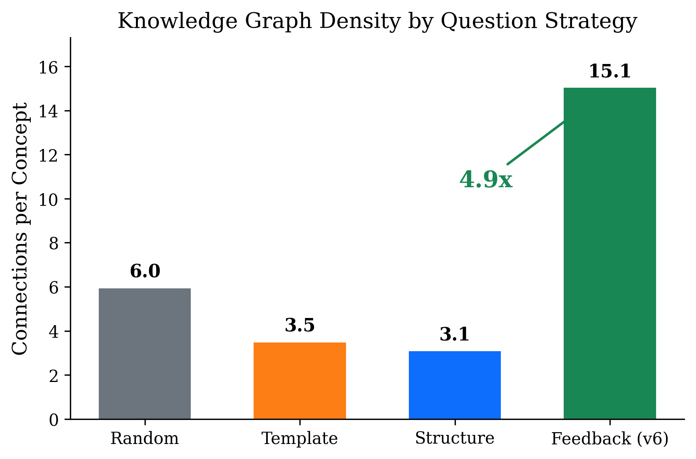
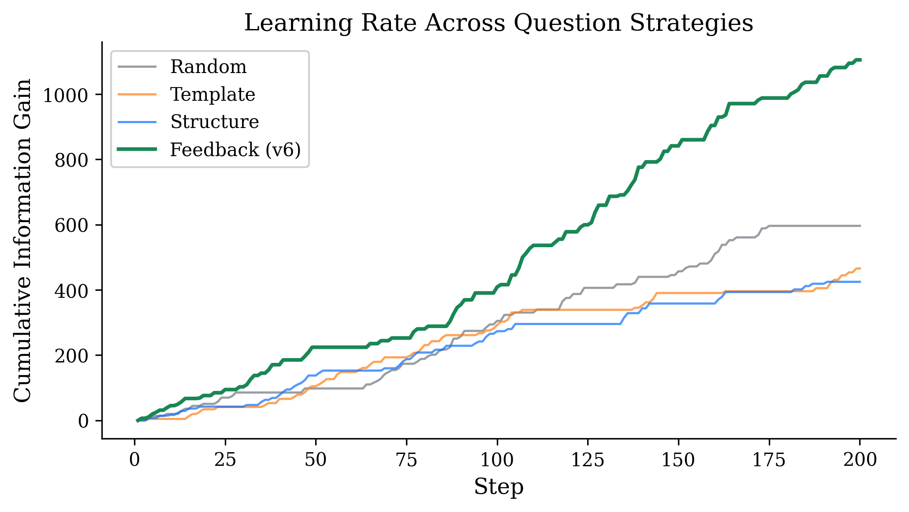
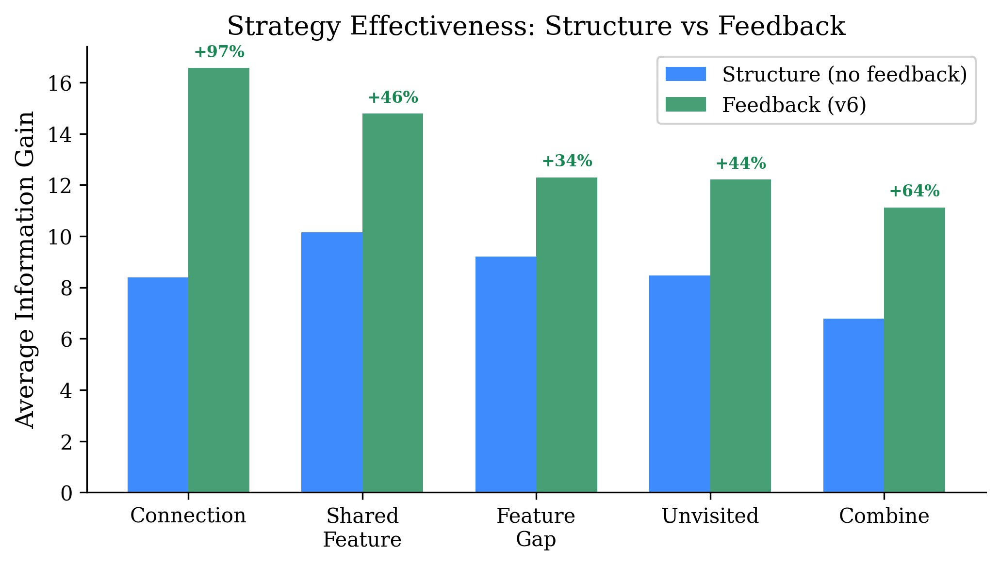

# Learning to Ask: Feedback-Driven Question Generation for Autonomous Knowledge Acquisition

> Using Language Models as Environments for Concept Learning

**Paper:** [`paper/paper.pdf`](paper/paper.pdf)

## Key Finding

An outer learning layer that uses a frozen LLM as an environment produces **4.9x denser knowledge graphs** when question generation is guided by a feedback loop that tracks which strategies produce the most learning.

| Mode | Concepts | Connections | Conn/Concept | Avg IG |
|---|---|---|---|---|
| **Feedback (v6)** | **20** | **301** | **15.1** | **13.48** |
| Random | 20 | 119 | 6.0 | 10.28 |
| Template | 20 | 70 | 3.5 | 9.13 |
| Structure | 20 | 62 | 3.1 | 8.85 |

### Surprise Finding

**Structure-driven questioning without feedback performs worse than random exploration.** Without adaptation, the system gets stuck in exploration ruts. The feedback loop transforms structure from a liability into an advantage.

## Architecture

```
┌──────────────────────────────────────────────────────────┐
│                    OUTER LAYER                           │
│                                                          │
│  ┌──────────┐    ┌──────────────┐    ┌───────────────┐  │
│  │ ConceptNet│◄──│ Knowledge    │◄──│  Strategy     │  │
│  │ (52K par) │   │ Graph        │   │  Selector     │  │
│  └─────┬────┘    └──────┬───────┘    └───────┬───────┘  │
│        │               │                    │           │
│        ▼               ▼                    ▼           │
│  ┌─────────────────────────────────────────────────┐    │
│  │              Learning Loop                       │    │
│  │  observe → abstract → question → integrate       │    │
│  └─────────────────────┬───────────────────────────┘    │
│                        │                                 │
└────────────────────────┼─────────────────────────────────┘
                         │ prompts / answers
                         ▼
┌──────────────────────────────────────────────────────────┐
│               ENVIRONMENT (Frozen LLM)                   │
│              Llama 3 8B Instruct (4-bit)                 │
│                  Weights never modified                   │
└──────────────────────────────────────────────────────────┘
```

The outer layer treats the LLM as an **environment**, not a subject. The LLM is the world; the outer layer is the learner.

## Quick Start

### Requirements

- Apple Silicon Mac (M1/M2/M3) with 16GB+ RAM
- Python 3.10+
- ~5GB disk for model download (first run only)

### Install

```bash
pip install -r requirements.txt
```

### Run

```bash
# Single 200-step session (default: feedback mode)
python src/concept_learner.py --steps 200

# Reproduce the full ablation study (~80 min total)
./run_ablation.sh

# Generate paper figures
python paper/figures/generate_figures.py
```

### Ablation Modes

```bash
python src/concept_learner.py --mode random    --steps 200 --seed 42 --reset
python src/concept_learner.py --mode template  --steps 200 --seed 42 --reset
python src/concept_learner.py --mode structure --steps 200 --seed 42 --reset
python src/concept_learner.py --mode feedback  --steps 200 --seed 42 --reset
```

| Mode | Description |
|---|---|
| `random` | Generic prompts, no concept awareness |
| `template` | Fixed templates using concept names, no structure analysis |
| `structure` | Structure-driven questions (feature gaps, shared features), equal weights |
| `feedback` | Full v6: structure-driven with learned strategy weights |

## Results

### Figure 1: Connection Density



### Figure 2: Cumulative Learning Rate



### Figure 3: Strategy Effectiveness



## Repo Structure

```
dream-layer/
├── README.md
├── LICENSE                          # MIT
├── requirements.txt
├── run_ablation.sh                  # Reproduce all 4 modes
├── src/
│   └── concept_learner.py           # Main experiment code (~1700 lines)
├── paper/
│   ├── paper.tex                    # LaTeX source
│   ├── paper.pdf                    # Compiled paper
│   └── figures/
│       ├── generate_figures.py      # Figure generation script
│       ├── fig1_connections.pdf
│       ├── fig2_cumulative_ig.pdf
│       └── fig3_strategy_breakdown.pdf
└── results/
    ├── ablation_random/             # Random mode data
    ├── ablation_template/           # Template mode data
    ├── ablation_structure/          # Structure mode data
    └── feedback/                    # Feedback (v6) mode data
```

## Citation

If you use this code or data in your research, please cite:

```bibtex
@misc{aggarwal2026learning,
  title={Learning to Ask: Feedback-Driven Question Generation for Autonomous Knowledge Acquisition},
  author={Aggarwal, Mohit},
  year={2026},
  url={https://github.com/aggarwalmew/dream-layer}
}
```

## License

MIT
